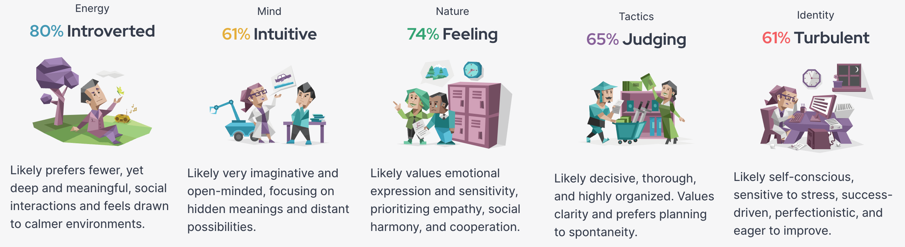
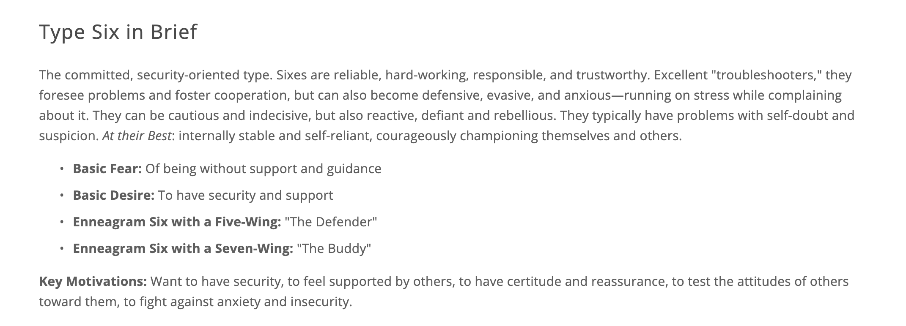
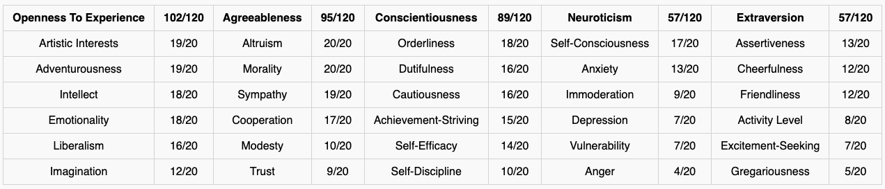

---
# the default layout is 'page'
layout: post
toc: true
icon: fas fa-sailboat
order: 100
---

## Introduction

Hi all! This is Wenxin (Livia) Lai. I'm now pursuing my master degree in Electrical and Computer Engineering at Carnegie Mellon University and am passionate about becoming a computer engineer, with a specialization in graphics and game engine development. This site is built for recording my thoughts, covering both my study, career path and my life. Hope it could witness my growth.

---

## Education

<b>Carnegie Mellon University</b>Pittsburgh, PA, U.S.

Master of Science in Electrical and Computer EngineeringAug. 2023 - May 2025

Courses:

(23Fall) Foundations of Computer Systems, Building Reliable Distributed System, Introdction to Computer Security;

(24Spring) Computer Graphics, How to Write Fast Code II, Introduction to Game Design; Parallel Computer Architecture and Programming (Partial);

<b>Tiangong University</b>Tianjin, China

Bachelor of Engineering in Computer Science and TechnologyAug. 2018 - Jun. 2022

Courses:

(Fundamental) Calculas, Linear Algebra, Probabilistic, Data Structure and Algorithms;

(System) Principles of Computer Composition, Compile System, Operating System, Computer Networking, Database, Cloud and Distributed System;

(AI) Machine Learning, Computer Vision, Digital Image Processing, Reinforcement Learning;

---

## Personality

**Myers-Briggs Type Indicator (MBTI)** &nbsp;&nbsp;&nbsp;&nbsp; <b style="color:green;">INFJ-T</b> &nbsp;&nbsp;&nbsp;&nbsp; [My Detailed Report](https://www.16personalities.com/profiles/9e449530db6cb)

{: w="800px"}

**Enneagram Type** &nbsp;&nbsp;&nbsp;&nbsp; <b style="color:green;">Type Six Wing Five</b> &nbsp;&nbsp;&nbsp;&nbsp; [Detailed Introduction](https://www.enneagraminstitute.com/type-6)

{: w="800px"}

**The Big Five** &nbsp;&nbsp;&nbsp;&nbsp; <b style="color:green;">Result as the table shown below</b> &nbsp;&nbsp;&nbsp;&nbsp; [My Detailed Report](https://bigfive-test.com/result/649db4e59de5fc00087594de)

{: w="1000px"}

<!-- | Openness To Experience 	| 102/120 	| Agreeableness 	| 95/120 	| Conscientiousness    	| 89/120 	| Neuroticism        	| 57/120 	| Extraversion       	| 57/120 	|
|------------------------	|---------	|---------------	|--------	|----------------------	|--------	|--------------------	|--------	|--------------------	|--------	|
| Artistic Interests     	| 19/20   	| Altruism      	| 20/20  	| Orderliness          	| 18/20  	| Self-Consciousness 	| 17/20  	| Assertiveness      	| 13/20  	|
| Adventurousness        	| 19/20   	| Morality      	| 20/20  	| Dutifulness          	| 16/20  	| Anxiety            	| 13/20  	| Cheerfulness       	| 12/20  	|
| Intellect              	| 18/20   	| Sympathy      	| 19/20  	| Cautiousness         	| 16/20  	| Immoderation       	| 9/20   	| Friendliness       	| 12/20  	|
| Emotionality           	| 18/20   	| Cooperation   	| 17/20  	| Achievement-Striving 	| 15/20  	| Depression         	| 7/20   	| Activity Level     	| 8/20   	|
| Liberalism             	| 16/20   	| Modesty       	| 10/20  	| Self-Efficacy        	| 14/20  	| Vulnerability      	| 7/20   	| Excitement-Seeking 	| 7/20   	|
| Imagination            	| 12/20   	| Trust         	| 9/20   	| Self-Discipline      	| 10/20  	| Anger              	| 4/20   	| Gregariousness     	| 5/20   	| -->

&nbsp;

&nbsp;

---

